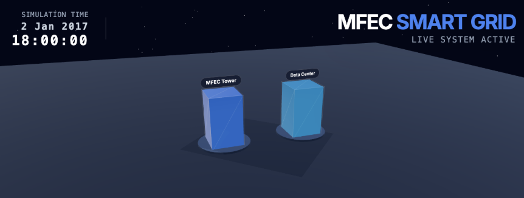
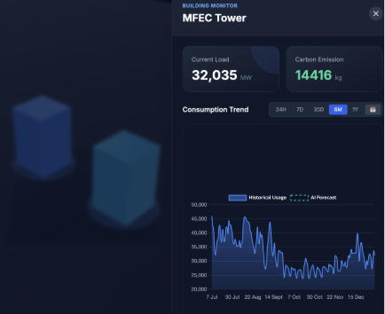
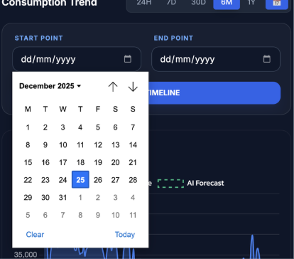
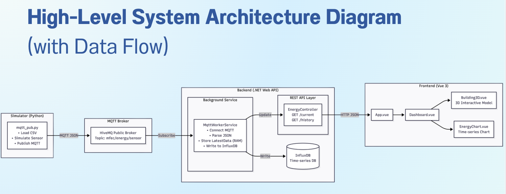

# ⚡ Smart Energy Monitoring System (Digital Twin)


> **MFEC Internship Assignment: IoT & AI Project**


การจำลองระบบ IoT สำหรับเก็บข้อมูลพลังงานแบบ Realtime ตั้งแต่การจำลอง Sensor, การส่งข้อมูลผ่าน MQTT, การจัดเก็บแบบ Time-series
 ไปจนถึงการแสดงผลผ่าน Web Dashboard และ 3D Interactive Model



โดยใช้ข้อมูล kaggle https://www.kaggle.com/datasets/robikscube/hourly-energy-consumption/data
เป็นข้อมูลตัวอย่างด้าน การใช้ไฟฟ้า เพื่อไปแทนข้อมูล การใช้ไฟฟ้าในอาคาร MFEC

<p align="center">
  
  
</p>

---

## ⚡ Smart Energy Monitoring System (MFEC Intern Assignment)

A Real-time 3D Energy Monitoring Dashboard that visualizes power consumption from IoT sensors using **Digital Twin** concepts.

<!-- เดี๋ยวจะเพิ่ม Tech Stack -->

---

## 🛠️ Tech Stack

### Frontend
* **Framework:** Vue.js 3 (Composition API)
* **3D Library:** TresJS (@tresjs/cientos)
* **Styling:** Tailwind CSS
* **Build Tool:** Vite

### Backend
* **Core:** .NET 8 Web API (C#)
* **Database:** InfluxDB (Time-series Database)
* **Protocol:** HTTP/REST

### IoT & Simulation
* **Language:** Python 3.9+
* **Protocol:** MQTT (Paho-MQTT)
* **Broker:** HiveMQ (Public Broker)
* **Data Processing:** Pandas

---

## 🛠️ Prerequisites (สิ่งที่ต้องมีก่อน)
* [Docker Desktop](https://www.docker.com/) (For Database)
* [.NET 8 SDK](https://dotnet.microsoft.com/en-us/download/dotnet/8.0)
* [Node.js](https://nodejs.org/) (v18+)
* [Python](https://www.python.org/) (v3.9+)

---

## 📦 Installation & Setup Guide

### Step 1: Start Infrastructure (Database)
We use Docker to run InfluxDB. Run the following command in the root directory:

```bash
# Start InfluxDB container
docker run -d -p 8086:8086 \
  --name influxdb_energy \
  -e DOCKER_INFLUXDB_INIT_MODE=setup \
  -e DOCKER_INFLUXDB_INIT_USERNAME=my-user \
  -e DOCKER_INFLUXDB_INIT_PASSWORD=my-password \
  -e DOCKER_INFLUXDB_INIT_ORG=mfec_org \
  -e DOCKER_INFLUXDB_INIT_BUCKET=energy_bucket \
  influxdb:2.0
```


### Step 2: Run the Backend API
```bash

cd Backend
dotnet restore
dotnet run
```
- The API will start at: http://localhost:5069 (or port 5xxx check your terminal).

- Note: Ensure EnergyController.cs has the correct InfluxDB Token.

### Step 3: Run the Frontend Dashboard
Open a new terminal:

```bash
cd Frontend
npm install
npm run dev
```
- The Dashboard will run at: http://localhost:5173.

### Step 4: Start the IoT Simulator
Open a new terminal. This script simulates sensors sending data via MQTT.

First, install dependencies:

```bash
cd Simulator
pip install pandas paho-mqtt
```
Then, run the simulator:
```Bash
python mqtt_pub.py
```
Note: Ensure the CSV file path in mqtt_pub.py matches your local machine's absolute path.

---

## 📂 Project Structure


```plaintext
mfec-intern-assignment/
├── Backend/                 # ASP.NET Core Web API
│   ├── Controllers/         # API Endpoints (EnergyController)
│   ├── Services/            # Background Services (MQTT Worker)
│   └── Program.cs           # App Configuration & CORS
├── Frontend/                # Vue.js Application
│   ├── src/components/      # Vue Components (Dashboard, Charts)
│   └── src/App.vue          # Main 3D Scene Logic
├── Simulator/               # Python Scripts
│   ├── mqtt_pub.py          # MQTT Publisher
│   └── requirements.txt     # Python Dependencies
├── Data/                    # Source Datasets (CSV)
└── README.md                # Project Documentation
```
